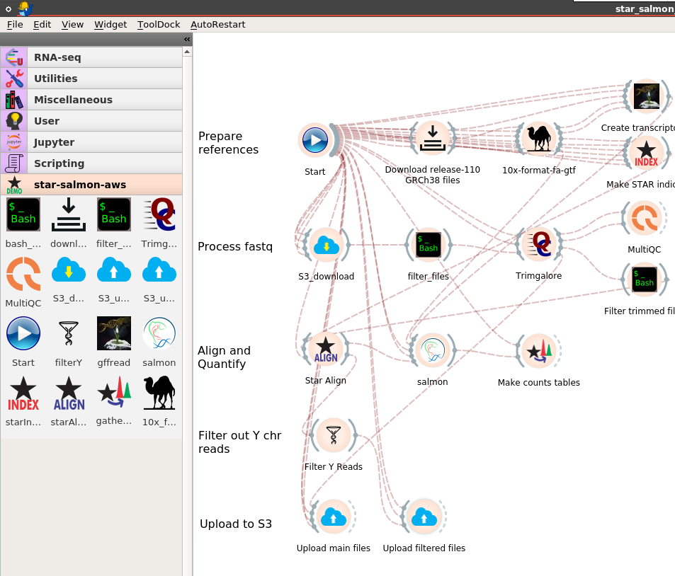

#Analytical workflow for Bulk RNA-seq


## Description of workflow
### Overview
The workflow aligns reads to a genome reference using STAR. Salmon is used to obtain transcript counts from the alignments and aggregate these into gene level counts. It is essentially the nf-core RNA-seq workflow with indexing and annotations done using 10x formats. 

### Where are the files?

####Output directory structure
The output files are under the processed tree in the morphic-bio-processing S3 bucket
```js
morphic-bio-processing
└── processed
    └── morphic-jax
        └── JAX_RNAseq_ExtraEmbryonic
            ├── Counts
            ├── Tables
            ├── alignedfiles
            ├── downloads
            └── trimmed
```
####Counts subdirectory
The counts are the output from the Salmon and documentation can be found [here](https://gensoft.pasteur.fr/docs/salmon/1.1.0/file_formats.html)
The key files are quant.genes.sf and quant.sf which contain the counts for genes and transcripts
```js
Counts
├── CE_E06__Hypoxia_GT23-11306_ATGTAAGT-CATAGAGT_S38_L001_R1_001_val
│   ├── aux_info
│   │   ├── ambig_info.tsv
│   │   ├── expected_bias.gz
│   │   ├── fld.gz
│   │   ├── meta_info.json
│   │   ├── observed_bias.gz
│   │   └── observed_bias_3p.gz
│   ├── cmd_info.json
│   ├── libParams
│   │   └── flenDist.txt
│   ├── logs
│   │   └── salmon_quant.log
│   ├── quant.genes.sf
│   └── quant.sf
```
####Tables subdirectory
The Tables directory contains the aggregated counts for all the samples in the submission. The tables have rounded integer values (Counts), numeric values (RawCounts) and normalized TPM values obtained from Salmon. The stats.csv table has the alignment stats and the featureCounts has the STAR unaligned featureCounts.
```js
Tables
├── featureCounts.csv
├── genesCounts.csv
├── genesRawCounts.csv
├── genesTPM.csv
├── stats.csv
├── txCounts.csv
├── txRawCounts.csv
└── txTPM.csv
```
####Aligned files subdirectory
These are files produced by STAR. The key files are Aligned.out.bam and Aligned.toTranscriptome.out.bam which have the alignments in genomic and transcriptomic coordinates respectively. Details on the output can be found in STAR documentation [here](https://raw.githubusercontent.com/alexdobin/STAR/master/doc/STARmanual.pdf)
```js
├── CE_E06__Hypoxia_GT23-11306_ATGTAAGT-CATAGAGT_S38_L001_R1_001_val
│   ├── Aligned.out.bam
│   ├── Aligned.toTranscriptome.out.bam
│   ├── Log.final.out
│   ├── Log.out
│   ├── Log.progress.out
│   ├── ReadsPerGene.out.tab
│   ├── SJ.out.tab
│   ├── _STARgenome
│   │   ├── sjdbInfo.txt
│   │   └── sjdbList.out.tab
│   └── _STARpass1
│       ├── Log.final.out
│       └── SJ.out.tab

```
####downloads subdirectory
These contain the downloaded files used to generate the indices and annotations. These are included for completeness and will not be part of the output in future datasets.
```js
downloads
├── Homo_sapiens.GRCh38.dna.primary_assembly.fa
├── Homo_sapiens.GRCh38.dna.primary_assembly.fa.gz.log
├── gencode.v44.primary_assembly.annotation.gtf
└── gencode.v44.primary_assembly.annotation.gtf.gz.log
```
####trimmed subdirectory
Contains output from Trimgalore, including fastqc reports.
```js
trimmed
├── CE_E06__Hypoxia_GT23-11306_ATGTAAGT-CATAGAGT_S38_L001_R1_001.fastq.gz_trimming_report.txt
├── CE_E06__Hypoxia_GT23-11306_ATGTAAGT-CATAGAGT_S38_L001_R1_001_val_1_fastqc.html
├── CE_E06__Hypoxia_GT23-11306_ATGTAAGT-CATAGAGT_S38_L001_R1_001_val_1_fastqc.zip
├── CE_E06__Hypoxia_GT23-11306_ATGTAAGT-CATAGAGT_S38_L001_R2_001.fastq.gz_trimming_report.txt
├── CE_E06__Hypoxia_GT23-11306_ATGTAAGT-CATAGAGT_S38_L001_R2_001_val_2_fastqc.html
├── CE_E06__Hypoxia_GT23-11306_ATGTAAGT-CATAGAGT_S38_L001_R2_001_val_2_fastqc.zip

```

### How do I run the workflow
You need to have Docker installed on the cloud instance or local computer. For remote deployments you need to forward ports 5900 for vnc access or 6080 for browser access. 

1. Start the Bwb server. Make sure that you start up Bwb where your .aws directory is available as a subdirectory.
```bash
docker run --rm -it -p 5900:5900  -p 6080:6080 -v ${PWD}:/data -v /srv/lhhung:/server -v /var/run/docker.sock:/var/run/docker.sock -v /tmp/.X11-unix:/tmp/.X11-unix  --privileged --group-add root biodepot/bwb:latest
```
2. Connect to the Bwb server using a VNC client like RealVNC on port 5900 or your browser on port 6080. If you are running on a VM or instance use the VM/instance IP. On your laptop use localhost as your IP (unless running a VM). So to connect with a browser type localhost:6080 in your browser search bar.

2. Load the workflow from the github. This is the star_salmon_aws directory.

4. Double-click on the Start icon and enter all the information in the forms.

5. Click on the Start button in the Start icon to start the workflow. 
